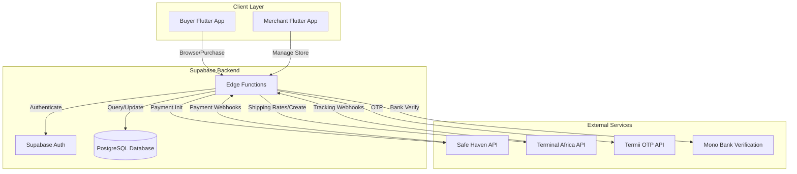
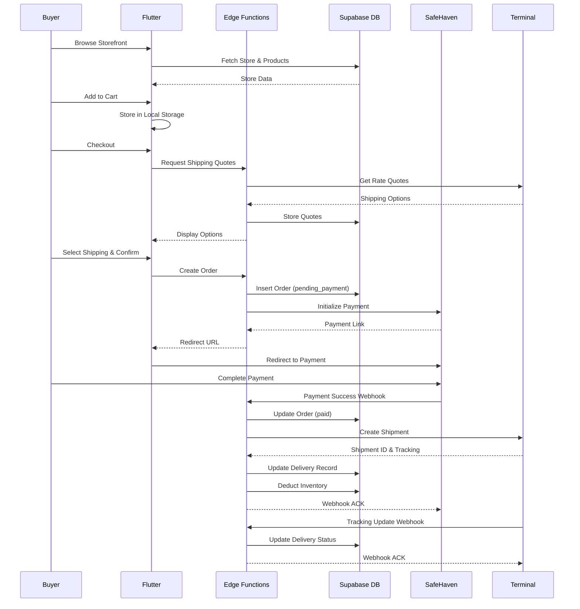
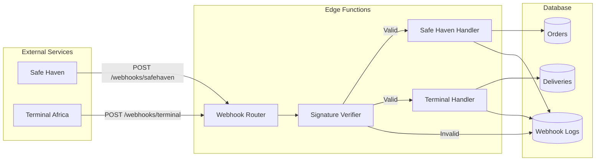
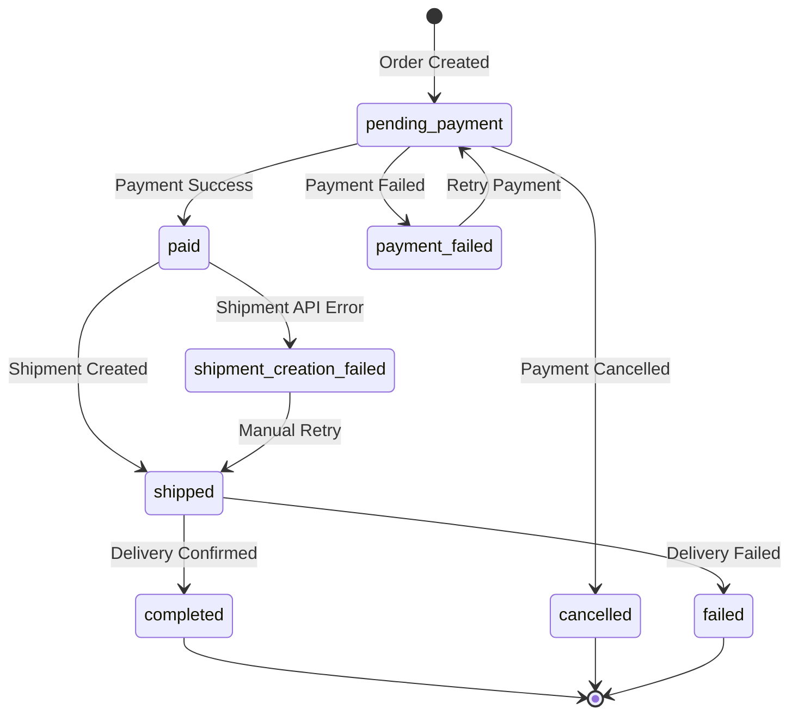
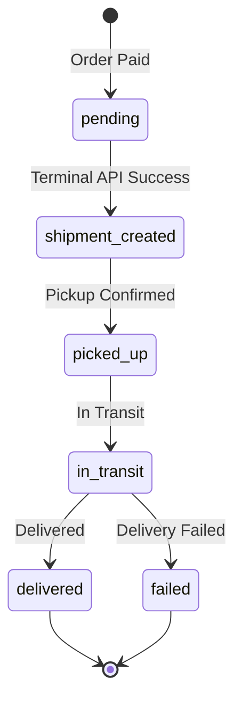

# Design Document: Hadi Platform Completion

## Overview

This design document specifies the technical implementation for completing the Hadi platform's missing functionality. The platform currently has merchant-facing UI and basic data structures but lacks critical integration logic for:

1. **Safe Haven Payment Integration** - Payment initialization and webhook handling
2. **Terminal Africa Shipping Integration** - Rate quotes, shipment creation, and tracking webhooks
3. **Buyer Storefront** - Complete public-facing shopping experience
4. **Inventory Management** - Stock tracking and deduction logic
5. **Order State Management** - Status transitions based on payment and delivery events

The implementation will use Flutter for the mobile/web frontend, Supabase for the backend database and authentication, and Supabase Edge Functions (Deno) for secure API integrations with external services.

### Technology Stack

- **Frontend**: Flutter (FlutterFlow-exported codebase)
- **Backend**: Supabase (PostgreSQL database)
- **Serverless Functions**: Supabase Edge Functions (Deno/TypeScript)
- **Payment Provider**: Safe Haven (Nigerian bank payment rails)
- **Logistics Provider**: Terminal Africa (shipping rates and fulfillment)
- **State Management**: Flutter Provider pattern (existing in codebase)
- **Local Storage**: SharedPreferences for cart persistence

## Architecture

### High-Level System Architecture



### Buyer Purchase Flow Architecture



### Webhook Processing Architecture



## Components and Interfaces

### 1. Buyer Storefront Components

#### 1.1 StorefrontPage Widget
**Purpose**: Display merchant's public store with products

**State**:
- `storeSlug: String` - URL slug for the store
- `store: StoresRow?` - Store data
- `products: List<ProductsRow>` - Active products
- `isLoading: bool` - Loading state

**Methods**:
- `fetchStoreBySlug(String slug)` - Query store from database
- `fetchStoreProducts(String storeId)` - Query active products
- `navigateToProduct(String productId)` - Navigate to product detail

**UI Elements**:
- Store banner image
- Store name and description
- Product grid with images, names, prices
- Error state for invalid store slug

#### 1.2 ProductDetailPage Widget
**Purpose**: Display detailed product information with variant selection

**State**:
- `product: ProductsRow` - Product data
- `variants: List<ProductVariantsRow>` - Product variants
- `selectedSize: String?` - Selected size
- `selectedColor: String?` - Selected color
- `selectedVariant: ProductVariantsRow?` - Resolved variant
- `quantity: int` - Selected quantity
- `currentPrice: double` - Calculated price based on selection

**Methods**:
- `fetchProductDetails(String productId)` - Load product and variants
- `onSizeSelected(String size)` - Update size selection and price
- `onColorSelected(String color)` - Update color selection and price
- `calculatePrice()` - Determine price based on variant selection
- `isVariantAvailable()` - Check stock availability
- `addToCart()` - Add selected product to cart
- `buyNow()` - Navigate directly to checkout

**UI Elements**:
- Image carousel
- Product name, description, weight
- Size selector (if applicable)
- Color selector (if applicable)
- Quantity selector
- Price display (updates dynamically)
- Add to Cart button
- Buy Now button
- Out of stock indicators
- Similar products section

#### 1.3 CartManager Service
**Purpose**: Manage cart state and persistence

**Data Model**:
```dart
class CartItem {
  String productId;
  String? variantId;
  String productName;
  String? variantDescription;
  double unitPrice;
  int quantity;
  int availableStock;
}
```

**Methods**:
- `addItem(CartItem item)` - Add or increment cart item
- `removeItem(String productId, String? variantId)` - Remove cart item
- `updateQuantity(String productId, String? variantId, int quantity)` - Update quantity
- `getCartItems()` - Retrieve all cart items
- `calculateSubtotal()` - Sum all item prices
- `clearCart()` - Empty the cart
- `saveToLocalStorage()` - Persist cart data
- `loadFromLocalStorage()` - Restore cart data
- `validateStock()` - Check if cart items are still in stock

**Storage**: Uses SharedPreferences to persist cart as JSON

#### 1.4 CartPage Widget
**Purpose**: Display and manage cart contents

**State**:
- `cartItems: List<CartItem>` - Current cart items
- `subtotal: double` - Calculated subtotal

**Methods**:
- `loadCart()` - Load cart from CartManager
- `onQuantityChanged(CartItem item, int newQuantity)` - Update item quantity
- `onRemoveItem(CartItem item)` - Remove item from cart
- `proceedToCheckout()` - Navigate to checkout

**UI Elements**:
- List of cart items with images, names, variants, quantities, prices
- Quantity adjustment controls
- Remove item buttons
- Subtotal display
- Proceed to Checkout button
- Empty cart state

### 2. Checkout Components

#### 2.1 CheckoutStep1Page Widget
**Purpose**: Collect buyer contact and delivery information

**State**:
- `buyerName: String` - Buyer's full name
- `buyerPhone: String` - Buyer's phone number
- `buyerEmail: String` - Buyer's email address
- `deliveryAddress: String` - Street address
- `deliveryCity: String` - City
- `deliveryState: String` - State/Province
- `deliveryLga: String` - Local Government Area
- `deliveryCountry: String` - Country (default: Nigeria)
- `formKey: GlobalKey<FormState>` - Form validation key

**Methods**:
- `validateForm()` - Validate all form fields
- `proceedToShipping()` - Navigate to shipping selection with form data

**Validation Rules**:
- Name: Required, min 2 characters
- Phone: Required, valid Nigerian phone format
- Email: Required, valid email format
- Address: Required, min 10 characters
- City, State, LGA: Required
- Country: Required

**UI Elements**:
- Form fields for all buyer and delivery information
- Validation error messages
- Continue button

#### 2.2 CheckoutStep2Page Widget
**Purpose**: Display shipping options and order summary

**State**:
- `orderData: Map<String, dynamic>` - Data from Step 1
- `shippingQuotes: List<ShippingQuote>` - Available shipping options
- `selectedQuote: ShippingQuote?` - Selected shipping option
- `subtotal: double` - Cart subtotal
- `deliveryFee: double` - Selected shipping cost
- `transactionFee: double` - Calculated transaction fee
- `totalAmount: double` - Final total
- `isLoadingQuotes: bool` - Loading state for quotes
- `isProcessingOrder: bool` - Loading state for order creation

**Methods**:
- `fetchShippingQuotes()` - Call Edge Function to get Terminal Africa quotes
- `onQuoteSelected(ShippingQuote quote)` - Update selected quote and recalculate
- `calculateTransactionFee()` - Calculate fee as percentage of subtotal + delivery
- `calculateTotal()` - Sum all amounts
- `placeOrder()` - Create order and initialize payment

**UI Elements**:
- Order summary (cart items)
- Shipping options with radio buttons (Standard, Priority)
- Price breakdown (Subtotal, Delivery Fee, Transaction Fee, Total)
- Place Order button
- Loading indicators
- Error messages

#### 2.3 ShippingQuote Model
```dart
class ShippingQuote {
  String id;
  String provider; // "terminal_africa"
  String serviceType; // "standard" or "priority"
  double rate;
  String currency;
  int estimatedDays;
  Map<String, dynamic> metadata;
}
```

### 3. Edge Functions

#### 3.1 terminal-get-quotes Function
**Purpose**: Fetch shipping rate quotes from Terminal Africa

**Endpoint**: `POST /functions/v1/terminal-get-quotes`

**Request Body**:
```typescript
interface GetQuotesRequest {
  pickup_address: {
    address: string;
    city: string;
    state: string;
    country: string;
    postal_code?: string;
  };
  delivery_address: {
    address: string;
    city: string;
    state: string;
    lga: string;
    country: string;
  };
  package: {
    weight_kg: number;
    items: Array<{
      name: string;
      quantity: number;
      value: number;
    }>;
  };
}
```

**Response**:
```typescript
interface GetQuotesResponse {
  success: boolean;
  quotes: Array<{
    id: string;
    service_type: string;
    rate: number;
    currency: string;
    estimated_days: number;
  }>;
  error?: string;
}
```

**Implementation**:
1. Validate request body
2. Call Terminal Africa Rate API with pickup, delivery, and package details
3. Parse response and extract rate quotes
4. Return formatted quotes to client
5. Log errors if API call fails

**Terminal Africa API Endpoint**: `POST https://api.terminal.africa/v1/rates`

**Required Headers**:
- `Authorization: Bearer {TERMINAL_API_KEY}`
- `Content-Type: application/json`

#### 3.2 orders-create Function
**Purpose**: Create order and initialize Safe Haven payment

**Endpoint**: `POST /functions/v1/orders-create`

**Request Body**:
```typescript
interface CreateOrderRequest {
  store_id: string;
  buyer: {
    name: string;
    phone: string;
    email: string;
  };
  delivery: {
    address: string;
    city: string;
    state: string;
    lga: string;
    country: string;
  };
  items: Array<{
    product_id: string;
    variant_id?: string;
    quantity: number;
    unit_price: number;
  }>;
  selected_quote_id: string;
  delivery_fee: number;
  transaction_fee: number;
  subtotal: number;
  total_amount: number;
}
```

**Response**:
```typescript
interface CreateOrderResponse {
  success: boolean;
  order_id: string;
  payment_url: string;
  error?: string;
}
```

**Implementation**:
1. Validate request body and authenticate user (optional for buyers)
2. Begin database transaction
3. Insert order record with status "pending_payment"
4. Insert order_items records
5. Call Safe Haven payment initialization API
6. Store payment reference in order
7. Commit transaction
8. Return payment URL to client
9. Rollback on any error

**Safe Haven API Endpoint**: `POST https://api.safehaven.io/v1/payments/initialize`

**Required Headers**:
- `Authorization: Bearer {SAFEHAVEN_API_KEY}`
- `Content-Type: application/json`

**Safe Haven Request Body**:
```typescript
{
  amount: number; // in kobo (multiply by 100)
  email: string;
  callback_url: string; // webhook endpoint
  metadata: {
    order_id: string;
    store_id: string;
  };
}
```

#### 3.3 webhooks-safehaven Function
**Purpose**: Handle Safe Haven payment webhooks

**Endpoint**: `POST /functions/v1/webhooks-safehaven`

**Request Headers**:
- `x-safehaven-signature: string` - Webhook signature for verification

**Request Body**:
```typescript
interface SafeHavenWebhook {
  event: "payment.success" | "payment.failed" | "payment.cancelled";
  data: {
    reference: string;
    amount: number;
    status: string;
    metadata: {
      order_id: string;
      store_id: string;
    };
  };
}
```

**Implementation**:
1. Verify webhook signature using HMAC-SHA256
2. Log webhook to webhook_logs table
3. Extract order_id from metadata
4. Based on event type:
   - **payment.success**: 
     - Update order status to "paid"
     - Call terminal-create-shipment function
     - Deduct inventory
   - **payment.failed**: Update order status to "payment_failed"
   - **payment.cancelled**: Update order status to "cancelled"
5. Return 200 OK response
6. Return 401 if signature invalid
7. Return 400 if payload invalid

**Signature Verification**:
```typescript
const signature = request.headers.get('x-safehaven-signature');
const payload = await request.text();
const expectedSignature = crypto
  .createHmac('sha256', SAFEHAVEN_WEBHOOK_SECRET)
  .update(payload)
  .digest('hex');
  
if (signature !== expectedSignature) {
  return new Response('Invalid signature', { status: 401 });
}
```

#### 3.4 terminal-create-shipment Function
**Purpose**: Create shipment via Terminal Africa after payment

**Endpoint**: `POST /functions/v1/terminal-create-shipment`

**Request Body**:
```typescript
interface CreateShipmentRequest {
  order_id: string;
}
```

**Response**:
```typescript
interface CreateShipmentResponse {
  success: boolean;
  shipment_id: string;
  tracking_url: string;
  error?: string;
}
```

**Implementation**:
1. Fetch order details from database
2. Fetch selected shipping quote
3. Fetch merchant pickup address
4. Call Terminal Africa Create Shipment API
5. Insert delivery record with shipment_id and tracking_url
6. Update order status to "shipped"
7. Deduct ordered quantities from inventory
8. Return shipment details

**Terminal Africa API Endpoint**: `POST https://api.terminal.africa/v1/shipments`

**Terminal Africa Request Body**:
```typescript
{
  pickup: {
    name: string;
    phone: string;
    address: string;
    city: string;
    state: string;
    country: string;
  };
  delivery: {
    name: string;
    phone: string;
    address: string;
    city: string;
    state: string;
    country: string;
  };
  package: {
    weight_kg: number;
    items: Array<{
      name: string;
      quantity: number;
      value: number;
    }>;
  };
  quote_id: string;
}
```

**Inventory Deduction Logic**:
```typescript
for (const item of orderItems) {
  if (item.variant_id) {
    // Deduct from variant stock
    await supabase
      .from('product_variants')
      .update({ 
        stock_quantity: sql`stock_quantity - ${item.quantity}` 
      })
      .eq('id', item.variant_id);
  } else {
    // Deduct from product stock
    await supabase
      .from('products')
      .update({ 
        stock_quantity: sql`stock_quantity - ${item.quantity}` 
      })
      .eq('id', item.product_id);
  }
}
```

#### 3.5 webhooks-terminal Function
**Purpose**: Handle Terminal Africa tracking webhooks

**Endpoint**: `POST /functions/v1/webhooks-terminal`

**Request Headers**:
- `x-terminal-signature: string` - Webhook signature

**Request Body**:
```typescript
interface TerminalWebhook {
  event: "shipment.picked_up" | "shipment.in_transit" | "shipment.delivered" | "shipment.failed";
  data: {
    shipment_id: string;
    status: string;
    tracking_events: Array<{
      status: string;
      location: string;
      timestamp: string;
      description: string;
    }>;
  };
}
```

**Implementation**:
1. Verify webhook signature
2. Log webhook to webhook_logs table
3. Find delivery record by shipment_id
4. Update delivery status based on event
5. Append tracking events to tracking_events JSON field
6. If status is "delivered", update order status to "completed"
7. Return 200 OK response

**Status Mapping**:
- `shipment.picked_up` → delivery status: "picked_up"
- `shipment.in_transit` → delivery status: "in_transit"
- `shipment.delivered` → delivery status: "delivered", order status: "completed"
- `shipment.failed` → delivery status: "failed"

#### 3.6 delivery-tickets-create Function
**Purpose**: Create delivery ticket and initialize payment for delivery-only shipments

**Endpoint**: `POST /functions/v1/delivery-tickets-create`

**Request Body**:
```typescript
interface CreateDeliveryTicketRequest {
  store_id: string;
  pickup: {
    name: string;
    phone: string;
    address: string;
    city: string;
    state: string;
    lga: string;
    country: string;
  };
  dropoff: {
    name: string;
    phone: string;
    address: string;
    city: string;
    state: string;
    lga: string;
    country: string;
  };
  items: Array<{
    name: string;
    weight_grams: number;
    quantity: number;
  }>;
  selected_quote_id: string;
  delivery_price: number;
}
```

**Response**:
```typescript
interface CreateDeliveryTicketResponse {
  success: boolean;
  ticket_id: string;
  payment_url: string;
  error?: string;
}
```

**Implementation**:
1. Validate request and authenticate merchant
2. Insert delivery_ticket record with status "pending_payment"
3. Insert delivery_ticket_items records
4. Initialize Safe Haven payment
5. Store payment reference
6. Return payment URL

#### 3.7 preorders-create-shipment Function
**Purpose**: Create shipment for pre-order when merchant requests pickup

**Endpoint**: `POST /functions/v1/preorders-create-shipment`

**Request Body**:
```typescript
interface CreatePreorderShipmentRequest {
  preorder_request_id: string;
}
```

**Response**:
```typescript
interface CreatePreorderShipmentResponse {
  success: boolean;
  shipment_id: string;
  tracking_url: string;
  error?: string;
}
```

**Implementation**:
1. Authenticate merchant
2. Fetch preorder request details
3. Fetch order and delivery details
4. Call Terminal Africa Create Shipment API
5. Update preorder_requests with shipment_id and tracking_url
6. Update status to "shipment_created"
7. Return shipment details

## Data Models

### Database Schema Updates

#### New Table: cart_items
```sql
CREATE TABLE cart_items (
  id UUID PRIMARY KEY DEFAULT uuid_generate_v4(),
  session_id TEXT NOT NULL,
  product_id UUID NOT NULL REFERENCES products(id),
  variant_id UUID REFERENCES product_variants(id),
  quantity INTEGER NOT NULL CHECK (quantity > 0),
  created_at TIMESTAMP WITH TIME ZONE DEFAULT NOW(),
  updated_at TIMESTAMP WITH TIME ZONE DEFAULT NOW()
);

CREATE INDEX idx_cart_items_session ON cart_items(session_id);
CREATE INDEX idx_cart_items_product ON cart_items(product_id);
```

#### New Table: webhook_logs
```sql
CREATE TABLE webhook_logs (
  id UUID PRIMARY KEY DEFAULT uuid_generate_v4(),
  provider TEXT NOT NULL, -- 'safehaven' or 'terminal'
  event_type TEXT NOT NULL,
  payload JSONB NOT NULL,
  signature TEXT,
  processed BOOLEAN DEFAULT FALSE,
  error TEXT,
  created_at TIMESTAMP WITH TIME ZONE DEFAULT NOW()
);

CREATE INDEX idx_webhook_logs_provider ON webhook_logs(provider);
CREATE INDEX idx_webhook_logs_processed ON webhook_logs(processed);
CREATE INDEX idx_webhook_logs_created ON webhook_logs(created_at);
```

#### New Table: shipping_quotes
```sql
CREATE TABLE shipping_quotes (
  id UUID PRIMARY KEY DEFAULT uuid_generate_v4(),
  order_id UUID REFERENCES orders(id),
  delivery_ticket_id UUID REFERENCES delivery_tickets(id),
  provider TEXT NOT NULL DEFAULT 'terminal_africa',
  service_type TEXT NOT NULL, -- 'standard' or 'priority'
  rate DECIMAL(10, 2) NOT NULL,
  currency TEXT NOT NULL DEFAULT 'NGN',
  estimated_days INTEGER,
  metadata JSONB,
  created_at TIMESTAMP WITH TIME ZONE DEFAULT NOW()
);

CREATE INDEX idx_shipping_quotes_order ON shipping_quotes(order_id);
CREATE INDEX idx_shipping_quotes_ticket ON shipping_quotes(delivery_ticket_id);
```

#### Updated Table: orders
Existing columns are sufficient, but ensure these exist:
- `safehaven_reference TEXT`
- `selected_delivery_quote_id UUID REFERENCES shipping_quotes(id)`
- `subtotal_amount INTEGER`
- `delivery_fee INTEGER`
- `transaction_fee INTEGER`
- `status TEXT` - Values: pending_payment, paid, shipped, completed, payment_failed, cancelled, shipment_creation_failed

#### Updated Table: deliveries
Existing columns are sufficient, but ensure these exist:
- `shipment_id TEXT` - Terminal Africa shipment ID
- `tracking_url TEXT`
- `status TEXT` - Values: pending, shipment_created, picked_up, in_transit, delivered, failed

#### Updated Table: delivery_tickets
Existing columns are sufficient, but ensure these exist:
- `terminal_shipment_id TEXT`
- `payment_reference TEXT`
- `payment_status TEXT` - Values: pending, paid, failed
- `tracking_events JSONB`

#### Updated Table: preorder_requests
Existing columns are sufficient, but ensure these exist:
- `terminal_shipment_id TEXT`
- `tracking_events JSONB`
- `status TEXT` - Values: pending, requested, shipment_created, in_transit, delivered

### Order Status State Machine



### Delivery Status State Machine



## Correctness Properties

*A property is a characteristic or behavior that should hold true across all valid executions of a system—essentially, a formal statement about what the system should do. Properties serve as the bridge between human-readable specifications and machine-verifiable correctness guarantees.*


### Property 1: Cart Addition Preserves Product Selection
*For any* valid product with variant and quantity, adding it to the cart should result in the cart containing that exact product, variant, and quantity.
**Validates: Requirements 3.1**

### Property 2: Cart Addition Idempotence
*For any* product already in the cart, adding it again should increment the quantity rather than creating a duplicate cart item.
**Validates: Requirements 3.2**

### Property 3: Stock Validation Prevents Overselling
*For any* product and quantity exceeding available stock, attempting to add to cart should be rejected with an error message.
**Validates: Requirements 3.6**

### Property 4: Cart Persistence Round Trip
*For any* cart state, saving to local storage then loading should produce an equivalent cart state.
**Validates: Requirements 3.7**

### Property 5: Shipping Quote Storage Completeness
*For any* valid Terminal Africa rate quote response, all quotes should be parsed and stored in the shipping_quotes table.
**Validates: Requirements 5.2**

### Property 6: Payment Reference Storage
*For any* successful Safe Haven payment initialization, the payment reference should be stored in the order record.
**Validates: Requirements 6.3**

### Property 7: Webhook Signature Verification
*For any* webhook with a valid signature, verification should pass; for any webhook with an invalid signature, verification should fail.
**Validates: Requirements 7.1, 16.1**

### Property 8: Payment Success Triggers Status Update
*For any* order in "pending_payment" status, a verified payment success webhook should transition the order to "paid" status.
**Validates: Requirements 7.2, 13.2**

### Property 9: Payment Success Triggers Shipment Creation
*For any* verified payment success webhook, shipment creation via Terminal Africa should be triggered.
**Validates: Requirements 7.3**

### Property 10: Shipment Creation Deducts Inventory
*For any* shipment created for an order, the ordered quantities should be deducted from product or variant stock_quantity.
**Validates: Requirements 8.8, 10.1**

### Property 11: Zero Stock Prevents Cart Addition
*For any* product or variant with stock_quantity of zero, attempting to add to cart should be prevented.
**Validates: Requirements 10.3**

### Property 12: Order Cancellation Restores Inventory
*For any* order cancelled before shipment, deducting inventory then cancelling should restore the original stock quantities.
**Validates: Requirements 10.5**

### Property 13: New Orders Start in Pending Payment
*For any* newly created order, the initial status should be "pending_payment".
**Validates: Requirements 13.1**

### Property 14: Invalid Status Transitions Are Prevented
*For any* invalid order status transition (e.g., "completed" to "pending_payment"), the system should prevent the transition and log the attempt.
**Validates: Requirements 13.8**

### Property 15: Invalid Webhook Signatures Are Rejected
*For any* webhook with an invalid signature, the system should respond with HTTP 401 status.
**Validates: Requirements 16.2**

### Property 16: Webhook Processing Idempotence
*For any* webhook, processing it multiple times should have the same effect as processing it once (idempotent behavior).
**Validates: Requirements 16.4**

### Property 17: Subtotal Calculation Correctness
*For any* cart, the subtotal should equal the sum of (quantity × unit_price) for all cart items.
**Validates: Requirements 17.1**

### Property 18: Transaction Fee Calculation Correctness
*For any* order, the transaction fee should equal the configured percentage of (subtotal + delivery_fee).
**Validates: Requirements 17.3**

### Property 19: Total Amount Calculation Correctness
*For any* order, the total_amount should equal subtotal_amount + delivery_fee + transaction_fee.
**Validates: Requirements 17.4**

### Property 20: Invalid Store Slug Shows Error
*For any* invalid or non-existent store slug, the storefront page should display an error message.
**Validates: Requirements 1.4**

### Property 21: Variant Selection Updates Price
*For any* product with variants, selecting a variant should update the displayed price to match the variant's price.
**Validates: Requirements 2.4**

### Property 22: Out of Stock Variants Are Disabled
*For any* variant with stock_quantity of zero, the variant selection should be disabled in the UI.
**Validates: Requirements 2.6**

### Property 23: Invalid Form Fields Show Errors
*For any* invalid checkout form input, the system should display specific error messages for the invalid fields.
**Validates: Requirements 4.7**

### Property 24: API Errors Are Logged and User-Friendly
*For any* Terminal Africa or Safe Haven API error, the error should be logged and a user-friendly message displayed.
**Validates: Requirements 5.3, 6.4**

### Property 25: Tracking Events Are Appended
*For any* tracking update webhook, new events should be appended to the tracking_events array, not replace existing events.
**Validates: Requirements 9.6**

### Property 26: Exponential Backoff Timing
*For any* sequence of failed API retry attempts, the delay between attempts should increase exponentially.
**Validates: Requirements 15.5**

### Property 27: Revenue Calculation Correctness
*For any* merchant, total revenue should equal the sum of all completed order amounts.
**Validates: Requirements 18.1**

### Property 28: Available Balance Calculation Correctness
*For any* merchant, available balance should equal total revenue minus completed payouts minus pending order amounts.
**Validates: Requirements 18.7**

## Error Handling

### API Integration Error Handling

**Terminal Africa API Errors**:
- Network timeouts: Retry with exponential backoff (1s, 2s, 4s, 8s, max 3 retries)
- Rate limiting (429): Queue request and retry after rate limit window
- Invalid request (400): Log error, display user-friendly message, do not retry
- Server errors (500): Retry with exponential backoff
- Authentication errors (401): Log critical error, alert administrators

**Safe Haven API Errors**:
- Network timeouts: Retry with exponential backoff
- Payment initialization failures: Display error to user with retry button
- Webhook delivery failures: Safe Haven will retry automatically
- Invalid payment reference: Log error and mark order for manual review

### Webhook Processing Error Handling

**Signature Verification Failures**:
- Log security warning with full request details
- Respond with HTTP 401
- Alert administrators if multiple failures from same IP

**Payload Validation Failures**:
- Log error with payload details
- Respond with HTTP 400
- Do not process webhook

**Database Update Failures**:
- Log error with full context
- Respond with HTTP 500 to trigger provider retry
- Implement idempotency to handle duplicate retries safely

### User-Facing Error Messages

**Cart Errors**:
- Out of stock: "Sorry, this item is currently out of stock"
- Quantity exceeds stock: "Only {available} items available"
- Invalid product: "This product is no longer available"

**Checkout Errors**:
- Shipping quote failure: "Unable to calculate shipping rates. Please try again"
- Payment initialization failure: "Payment processing is temporarily unavailable. Please try again"
- Form validation: Specific field-level errors (e.g., "Please enter a valid email address")

**Order Status Errors**:
- Shipment creation failure: "Your payment was successful, but we're having trouble creating your shipment. Our team will contact you shortly"
- Tracking unavailable: "Tracking information will be available once your order ships"

## Testing Strategy

### Dual Testing Approach

The testing strategy employs both unit tests and property-based tests to ensure comprehensive coverage:

**Unit Tests**: Focus on specific examples, edge cases, and integration points
- Test specific webhook payloads (payment success, payment failed, tracking updates)
- Test specific cart scenarios (empty cart, single item, multiple items)
- Test specific error conditions (invalid signatures, API timeouts)
- Test UI component rendering with specific data
- Test database schema migrations

**Property-Based Tests**: Verify universal properties across all inputs
- Test cart operations with randomly generated products and quantities
- Test payment calculations with randomly generated order data
- Test inventory deduction with randomly generated orders
- Test webhook signature verification with randomly generated payloads
- Test status transitions with randomly generated order states

### Property-Based Testing Configuration

**Testing Library**: Use `fast_check` for Dart/Flutter property-based testing

**Test Configuration**:
- Minimum 100 iterations per property test
- Each test tagged with: `Feature: hadi-platform-completion, Property {number}: {property_text}`
- Seed-based randomization for reproducibility
- Shrinking enabled to find minimal failing cases

**Example Property Test Structure**:
```dart
import 'package:fast_check/fast_check.dart';

// Feature: hadi-platform-completion, Property 1: Cart Addition Preserves Product Selection
test('Adding product to cart preserves selection', () {
  fc.assert(
    fc.property(
      fc.record({
        'productId': fc.uuid(),
        'variantId': fc.option(fc.uuid()),
        'quantity': fc.integer(min: 1, max: 100),
        'unitPrice': fc.double(min: 1.0, max: 10000.0),
      }),
      (productData) {
        final cart = CartManager();
        final item = CartItem(
          productId: productData['productId'],
          variantId: productData['variantId'],
          quantity: productData['quantity'],
          unitPrice: productData['unitPrice'],
        );
        
        cart.addItem(item);
        final cartItems = cart.getCartItems();
        
        expect(cartItems.length, equals(1));
        expect(cartItems[0].productId, equals(item.productId));
        expect(cartItems[0].variantId, equals(item.variantId));
        expect(cartItems[0].quantity, equals(item.quantity));
      },
    ),
    numRuns: 100,
  );
});
```

### Integration Testing

**API Integration Tests**:
- Mock Terminal Africa and Safe Haven APIs
- Test complete flows: checkout → payment → shipment creation
- Test webhook handling with simulated provider requests
- Test error scenarios and retry logic

**Database Integration Tests**:
- Test schema migrations
- Test complex queries (revenue calculations, inventory updates)
- Test transaction rollbacks on errors
- Test concurrent access scenarios

**End-to-End Tests**:
- Test complete buyer journey: browse → cart → checkout → payment
- Test complete merchant journey: create product → receive order → track shipment
- Test delivery-only ticket flow
- Test pre-order flow

### Test Coverage Goals

- Unit test coverage: >80% for business logic
- Property test coverage: All 28 correctness properties implemented
- Integration test coverage: All API integration points
- E2E test coverage: All critical user journeys

### Testing Edge Cases

**Cart Edge Cases**:
- Empty cart checkout attempt
- Cart with out-of-stock items
- Cart with items from multiple stores (should be prevented)
- Cart persistence across app restarts

**Payment Edge Cases**:
- Payment timeout scenarios
- Duplicate webhook delivery
- Webhook received before order creation completes
- Payment amount mismatch

**Inventory Edge Cases**:
- Concurrent purchases of last item in stock
- Inventory deduction when variant doesn't exist
- Negative stock quantities (should be prevented)
- Cancelled order inventory restoration

**Shipping Edge Cases**:
- No shipping quotes available for address
- Shipment creation after payment but before inventory deduction
- Tracking updates for non-existent shipments
- Multiple tracking updates in rapid succession

## Security Considerations

### Webhook Security

**Signature Verification**:
- All webhooks must include valid HMAC-SHA256 signatures
- Signatures verified using provider-specific secret keys
- Invalid signatures result in immediate rejection (HTTP 401)
- Multiple failed signature attempts trigger security alerts

**Payload Validation**:
- All webhook payloads validated against expected schema
- Required fields checked before processing
- Unexpected fields logged but not processed
- Malformed JSON rejected immediately

**Idempotency**:
- Webhook IDs tracked in webhook_logs table
- Duplicate webhooks detected and skipped
- Idempotent database operations (e.g., status updates)
- Race condition handling for concurrent webhooks

### API Key Management

**Environment Variables**:
- All API keys stored as Supabase environment variables
- Never exposed in client-side code
- Separate keys for development, staging, production
- Regular key rotation policy

**Edge Function Security**:
- Edge Functions use Supabase service role for database access
- Client requests authenticated via Supabase Auth where appropriate
- Rate limiting on Edge Function endpoints
- Request logging for audit trail

### Data Security

**PII Protection**:
- Buyer email and phone encrypted at rest
- Payment references stored securely
- No credit card data stored (handled by Safe Haven)
- GDPR-compliant data retention policies

**Database Security**:
- Row-level security (RLS) policies on all tables
- Merchants can only access their own store data
- Buyers cannot access other buyers' orders
- Admin access logged and audited

### HTTPS and Transport Security

**All Communications**:
- HTTPS required for all API endpoints
- TLS 1.2 or higher enforced
- Certificate pinning for mobile apps
- Secure WebSocket connections for real-time updates

## Performance Considerations

### Database Optimization

**Indexes**:
- Index on orders.status for status-based queries
- Index on orders.store_id for merchant order lookups
- Index on orders.safehaven_reference for webhook processing
- Index on deliveries.shipment_id for tracking updates
- Composite index on (store_id, created_at) for merchant dashboards

**Query Optimization**:
- Use database views for complex revenue calculations
- Implement pagination for order lists
- Cache frequently accessed data (store details, product lists)
- Use database functions for atomic inventory updates

### API Performance

**Caching**:
- Cache Terminal Africa rate quotes for 5 minutes
- Cache store and product data with CDN
- Implement Redis cache for session data
- Cache-Control headers on static assets

**Rate Limiting**:
- Implement rate limiting on Edge Functions (100 req/min per IP)
- Queue requests during high traffic
- Graceful degradation when APIs are slow
- Circuit breaker pattern for external API calls

### Frontend Performance

**Code Splitting**:
- Lazy load buyer storefront pages
- Separate bundles for merchant and buyer apps
- Tree shaking to remove unused code
- Minification and compression

**Image Optimization**:
- Compress product images on upload
- Generate multiple sizes for responsive images
- Use WebP format with fallbacks
- Lazy load images below the fold

**State Management**:
- Minimize unnecessary rebuilds
- Use Flutter Provider for efficient state updates
- Debounce cart updates to reduce writes
- Batch database operations where possible

## Deployment Strategy

### Supabase Edge Functions Deployment

**Function Organization**:
```
supabase/functions/
├── terminal-get-quotes/
│   └── index.ts
├── terminal-create-shipment/
│   └── index.ts
├── orders-create/
│   └── index.ts
├── webhooks-safehaven/
│   └── index.ts
├── webhooks-terminal/
│   └── index.ts
├── delivery-tickets-create/
│   └── index.ts
└── preorders-create-shipment/
    └── index.ts
```

**Deployment Process**:
1. Test functions locally with Supabase CLI
2. Deploy to staging environment
3. Run integration tests against staging
4. Deploy to production with zero downtime
5. Monitor function logs and error rates

### Database Migration Strategy

**Migration Steps**:
1. Create new tables (cart_items, webhook_logs, shipping_quotes)
2. Add new columns to existing tables
3. Create indexes on new and existing columns
4. Update RLS policies for new tables
5. Test migrations on staging database
6. Apply migrations to production during low-traffic window
7. Verify data integrity post-migration

### Flutter App Deployment

**Version Management**:
- Semantic versioning (MAJOR.MINOR.PATCH)
- Feature flags for gradual rollout
- A/B testing for new buyer flows
- Rollback capability for critical issues

**Release Process**:
1. Build and test on staging
2. Submit to app stores (iOS App Store, Google Play)
3. Gradual rollout (10% → 50% → 100%)
4. Monitor crash reports and user feedback
5. Hot-fix capability for critical bugs

## Monitoring and Observability

### Logging

**Application Logs**:
- All Edge Function invocations logged
- API call successes and failures logged
- Webhook processing logged with full payload
- Error stack traces captured

**Log Levels**:
- ERROR: API failures, webhook signature failures, database errors
- WARN: Retry attempts, rate limiting, validation failures
- INFO: Successful operations, status transitions
- DEBUG: Detailed request/response data (staging only)

### Metrics

**Business Metrics**:
- Orders created per hour
- Payment success rate
- Shipment creation success rate
- Average order value
- Cart abandonment rate

**Technical Metrics**:
- Edge Function response times
- Database query performance
- External API response times
- Webhook processing latency
- Error rates by endpoint

### Alerting

**Critical Alerts**:
- Payment webhook processing failures
- Shipment creation failures after payment
- Database connection failures
- Multiple webhook signature failures (security)

**Warning Alerts**:
- API response time > 5 seconds
- Error rate > 5%
- Inventory sync issues
- Webhook retry exhaustion

### Health Checks

**Endpoint Health**:
- `/health` endpoint for each Edge Function
- Database connectivity check
- External API connectivity check
- Response time monitoring

**Automated Testing**:
- Synthetic transactions every 5 minutes
- End-to-end flow testing in production
- Canary deployments with automated rollback
- Load testing before major releases

## Future Enhancements

### Phase 2 Features

**Multi-Currency Support**:
- Support for USD, GBP, EUR in addition to NGN
- Real-time exchange rate integration
- Currency conversion in checkout

**Advanced Inventory Management**:
- Low stock alerts for merchants
- Automatic reorder suggestions
- Inventory forecasting based on sales trends
- Bulk inventory updates

**Enhanced Analytics**:
- Merchant dashboard with sales charts
- Product performance analytics
- Customer behavior insights
- Revenue forecasting

**Buyer Features**:
- Buyer accounts and order history
- Wishlist functionality
- Product reviews and ratings
- Social sharing of products

### Scalability Improvements

**Database Sharding**:
- Shard by store_id for horizontal scaling
- Read replicas for analytics queries
- Separate databases for transactional and analytical workloads

**Microservices Architecture**:
- Separate services for payments, shipping, inventory
- Event-driven architecture with message queues
- Independent scaling of services
- Service mesh for inter-service communication

**Global Distribution**:
- Multi-region deployment
- CDN for static assets
- Edge caching for API responses
- Geographic routing for low latency
