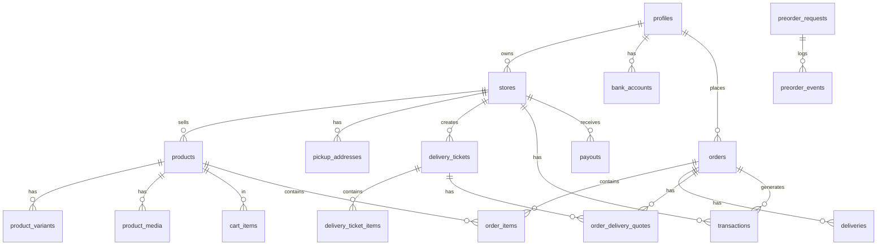

# Supabase Schema Reference

Complete reference for the Hadi Platform Supabase database schema.

---

## Schema Overview

**Schema**: `public`  
**Total Tables**: 19  
**RLS Enabled**: All tables

---

## Tables

### User Management

#### profiles
**Purpose**: Represents every human user (merchants and buyers). Supabase Auth handles authentication — this table handles identity & role.

| Column | Type | Nullable | Default | Notes |
|--------|------|----------|---------|-------|
| id | uuid | No | - | Primary key, references auth.users |
| role | text | No | 'buyer' | Values: 'buyer', 'merchant' |
| full_name | text | Yes | - | User's full name |
| phone | text | Yes | - | Phone number |
| email | text | Yes | - | Email address |
| first_name | text | Yes | - | First name |
| last_name | text | Yes | - | Last name |
| profile_image_url | text | Yes | - | Profile image URL |
| referral_code | text | Yes | - | Referral code |
| heard_about | text | Yes | - | How user heard about platform |
| created_at | timestamptz | No | now() | Creation timestamp |

**Foreign Keys**: Referenced by stores.owner_id, bank_accounts.merchant_id, orders.buyer_id

---

### Store Management

#### stores
**Purpose**: Each merchant owns one storefront with a public link.

| Column | Type | Nullable | Default | Notes |
|--------|------|----------|---------|-------|
| id | uuid | No | gen_random_uuid() | Primary key |
| owner_id | uuid | No | - | FK to profiles.id |
| name | text | Yes | - | Store name |
| slug | text | Yes | - | Unique URL slug |
| description | text | Yes | - | Store description |
| is_active | boolean | No | true | Active status |
| banner_url | text | Yes | - | Banner image URL |
| logo_url | text | Yes | - | Logo image URL |
| business_info_complete | boolean | No | false | Onboarding flag |
| bank_complete | boolean | No | false | Onboarding flag |
| pickup_address_complete | boolean | No | false | Onboarding flag |
| storefront_setup_complete | boolean | No | false | Onboarding flag |
| onboarding_complete | boolean | No | false | Overall onboarding status |
| registration_status | text | Yes | - | Business registration status |
| rc_number | text | Yes | - | Registration number |
| default_pickup_address_id | uuid | Yes | - | FK to pickup_addresses.id |
| created_at | timestamptz | No | now() | Creation timestamp |

**Indexes**: slug (unique)

---

### Product Management

#### products
**Purpose**: Products that appear on a merchant's storefront.

| Column | Type | Nullable | Default | Notes |
|--------|------|----------|---------|-------|
| id | uuid | No | gen_random_uuid() | Primary key |
| store_id | uuid | No | - | FK to stores.id |
| name | text | No | - | Product name |
| description | text | Yes | - | Product description |
| price | numeric | No | - | Base price |
| stock_quantity | smallint | Yes | 0 | Stock quantity |
| is_active | boolean | Yes | true | Active status |
| category | text | Yes | - | Product category |
| weight_grams | numeric | Yes | - | Weight in grams |
| is_preorder | boolean | Yes | false | Pre-order flag |
| pickup_address_id | uuid | Yes | - | FK to pickup_addresses.id |
| created_at | timestamptz | No | now() | Creation timestamp |

#### product_variants
**Purpose**: Size/color variants with their own price and quantity.

| Column | Type | Nullable | Default | Notes |
|--------|------|----------|---------|-------|
| id | uuid | No | gen_random_uuid() | Primary key |
| product_id | uuid | No | - | FK to products.id |
| size | text | Yes | - | Size option |
| color | text | Yes | - | Color option |
| price_amount | bigint | No | - | Price in kobo (minor units) |
| quantity | integer | No | - | Stock quantity |
| is_active | boolean | Yes | true | Active status |
| created_at | timestamptz | No | now() | Creation timestamp |

#### product_media
**Purpose**: Product images and videos.

| Column | Type | Nullable | Default | Notes |
|--------|------|----------|---------|-------|
| id | uuid | No | gen_random_uuid() | Primary key |
| product_id | uuid | No | - | FK to products.id |
| storage_path | text | No | - | Supabase storage path |
| public_url | text | Yes | - | Public URL |
| file_name | text | Yes | - | Original file name |
| file_size | bigint | Yes | - | File size in bytes |
| sort_order | integer | Yes | 0 | Display order |
| is_video | boolean | Yes | - | Video flag |
| created_at | timestamptz | No | now() | Creation timestamp |

---

### Shopping Cart

#### cart_items
**Purpose**: Shopping cart persistence for buyer sessions.

| Column | Type | Nullable | Default | Notes |
|--------|------|----------|---------|-------|
| id | uuid | No | gen_random_uuid() | Primary key |
| session_id | text | No | - | Session identifier |
| product_id | uuid | No | - | FK to products.id |
| variant_id | uuid | Yes | - | FK to product_variants.id |
| quantity | integer | No | - | Quantity (must be > 0) |
| created_at | timestamptz | No | now() | Creation timestamp |
| updated_at | timestamptz | No | now() | Last update timestamp |

**Indexes**: session_id, product_id, variant_id  
**Triggers**: Auto-update updated_at on modification

---

### Orders and Checkout

#### orders
**Purpose**: Represents a buyer's checkout attempt (paid or unpaid).

| Column | Type | Nullable | Default | Notes |
|--------|------|----------|---------|-------|
| id | uuid | No | gen_random_uuid() | Primary key |
| store_id | uuid | No | - | FK to stores.id |
| buyer_id | uuid | Yes | - | FK to profiles.id |
| status | text | Yes | 'pending_payment' | Order status |
| total_amount | numeric | No | - | Total order amount |
| currency | text | Yes | 'NGN' | Currency code |
| payment_reference | text | Yes | - | Payment reference |
| safehaven_reference | text | Yes | - | Safe Haven reference |
| subtotal_amount | bigint | Yes | - | Subtotal in kobo |
| delivery_fee | bigint | Yes | - | Delivery fee in kobo |
| transaction_fee | bigint | Yes | - | Transaction fee in kobo |
| selected_delivery_quote_id | uuid | Yes | - | FK to order_delivery_quotes.id |
| buyer_full_name | text | Yes | - | Buyer name (denormalized) |
| buyer_phone | text | Yes | - | Buyer phone (denormalized) |
| buyer_email | text | Yes | - | Buyer email (denormalized) |
| delivery_country | text | Yes | - | Delivery country |
| delivery_state | text | Yes | - | Delivery state |
| delivery_lga | text | Yes | - | Delivery LGA |
| delivery_address | text | Yes | - | Delivery address |
| created_at | timestamptz | No | now() | Creation timestamp |

**Status Values**: `pending_payment`, `paid`, `shipped`, `completed`, `payment_failed`, `cancelled`, `shipment_creation_failed`

#### order_items
**Purpose**: Line items for each order.

| Column | Type | Nullable | Default | Notes |
|--------|------|----------|---------|-------|
| id | uuid | No | gen_random_uuid() | Primary key |
| order_id | uuid | No | - | FK to orders.id |
| product_id | uuid | No | - | FK to products.id |
| variant_id | uuid | Yes | - | FK to product_variants.id (legacy) |
| product_variant_id | uuid | Yes | - | FK to product_variants.id (preferred) |
| quantity | smallint | No | - | Quantity ordered |
| unit_price | numeric | No | - | Price per unit |
| line_total_amount | numeric | Yes | - | Total for this line |
| created_at | timestamptz | No | now() | Creation timestamp |

**Note**: Use `product_variant_id` consistently (both `variant_id` and `product_variant_id` exist for compatibility).

#### order_delivery_quotes
**Purpose**: Delivery quotes for orders and delivery tickets from Terminal Africa.

| Column | Type | Nullable | Default | Notes |
|--------|------|----------|---------|-------|
| id | uuid | No | gen_random_uuid() | Primary key |
| order_id | uuid | Yes | - | FK to orders.id |
| delivery_ticket_id | uuid | Yes | - | FK to delivery_tickets.id |
| service_level | text | No | - | Service level |
| eta_text | text | Yes | - | Estimated delivery time |
| provider_name | text | No | - | Provider name |
| price_amount | bigint | No | - | Price in kobo |
| currency | text | Yes | 'NGN' | Currency code |
| category | text | Yes | - | 'high_priority' or 'standard' |
| raw_quote | jsonb | Yes | - | Raw API response |
| created_at | timestamptz | No | now() | Creation timestamp |

**Constraint**: Either order_id OR delivery_ticket_id must be set (not both)

---

### Delivery and Logistics

#### deliveries
**Purpose**: Tracks logistics state for orders.

| Column | Type | Nullable | Default | Notes |
|--------|------|----------|---------|-------|
| id | uuid | No | gen_random_uuid() | Primary key |
| order_id | uuid | No | - | FK to orders.id |
| shipment_id | text | Yes | - | Terminal Africa shipment ID |
| status | text | Yes | 'pending_pickup' | Delivery status |
| tracking_url | text | Yes | - | Tracking URL |
| created_at | timestamptz | No | now() | Creation timestamp |

**Status Values**: `pending_pickup`, `picked_up`, `in_transit`, `delivered`, `failed`

#### delivery_tickets
**Purpose**: Standalone delivery tickets for merchant-initiated shipments.

| Column | Type | Nullable | Default | Notes |
|--------|------|----------|---------|-------|
| id | uuid | No | gen_random_uuid() | Primary key |
| store_id | uuid | No | - | FK to stores.id |
| delivery_price_amount | numeric | Yes | - | Delivery price |
| currency | text | No | 'NGN' | Currency code |
| pickup_* | various | varies | - | Pickup address fields |
| dropoff_* | various | varies | - | Dropoff address fields |
| status | text | No | 'pending' | Ticket status |
| terminal_shipment_id | text | Yes | - | Terminal shipment ID |
| tracking_url | text | Yes | - | Tracking URL |
| tracking_events | jsonb | No | '[]' | Event log |
| payment_reference | text | Yes | - | Payment reference |
| payment_status | text | Yes | 'unpaid' | Payment status |
| created_at | timestamptz | No | now() | Creation timestamp |
| updated_at | timestamptz | No | now() | Last update timestamp |

**Status Values**: `pending`, `quoted`, `paid`, `created`, `pickup_scheduled`, `in_transit`, `delivered`, `cancelled`, `failed`  
**Payment Status Values**: `unpaid`, `pending`, `paid`, `failed`, `refunded`

#### delivery_ticket_items
**Purpose**: Items in delivery tickets.

| Column | Type | Nullable | Default | Notes |
|--------|------|----------|---------|-------|
| id | uuid | No | gen_random_uuid() | Primary key |
| delivery_ticket_id | uuid | No | - | FK to delivery_tickets.id |
| item_name | text | No | - | Item name |
| item_amount | numeric | Yes | - | Item value |
| quantity | integer | No | 1 | Quantity (must be > 0) |
| weight_grams | integer | Yes | - | Weight in grams |
| image_url | text | Yes | - | Item image URL |
| created_at | timestamptz | No | now() | Creation timestamp |

---

### Pre-orders

#### preorder_requests
**Purpose**: Pre-order requests for products not yet in stock.

| Column | Type | Nullable | Default | Notes |
|--------|------|----------|---------|-------|
| id | uuid | No | gen_random_uuid() | Primary key |
| store_id | uuid | No | - | FK to stores.id |
| product_id | uuid | No | - | FK to products.id |
| product_variant_id | uuid | Yes | - | FK to product_variants.id |
| quantity | integer | No | 1 | Quantity (must be > 0) |
| status | text | No | 'pending' | Pre-order status |
| requested_at | timestamptz | Yes | - | Request timestamp |
| last_resent_at | timestamptz | Yes | - | Last resend timestamp |
| notes | text | Yes | - | Additional notes |
| terminal_shipment_id | text | Yes | - | Terminal shipment ID |
| tracking_url | text | Yes | - | Tracking URL |
| tracking_events | jsonb | No | '[]' | Event log |
| created_at | timestamptz | No | now() | Creation timestamp |
| updated_at | timestamptz | No | now() | Last update timestamp |

**Status Values**: `pending`, `requested`, `tracking`, `delivered`, `cancelled`, `failed`

#### preorder_events
**Purpose**: Event log for pre-order requests.

| Column | Type | Nullable | Default | Notes |
|--------|------|----------|---------|-------|
| id | uuid | No | gen_random_uuid() | Primary key |
| preorder_request_id | uuid | No | - | FK to preorder_requests.id |
| event_type | text | No | - | Event type |
| event_at | timestamptz | No | now() | Event timestamp |
| payload | jsonb | No | '{}' | Event data |

---

### Financial

#### bank_accounts
**Purpose**: Merchant payout details.

| Column | Type | Nullable | Default | Notes |
|--------|------|----------|---------|-------|
| id | uuid | No | gen_random_uuid() | Primary key |
| merchant_id | uuid | No | - | FK to profiles.id |
| store_id | uuid | Yes | - | FK to stores.id |
| bank_name | text | No | - | Bank name |
| bank_code | text | No | - | Bank code |
| account_number | text | No | - | Account number |
| account_name | text | No | - | Account name |
| verified | boolean | No | false | Verification status |
| verified_at | timestamptz | Yes | - | Verification timestamp |
| verification_ref | text | Yes | - | Verification reference |
| created_at | timestamptz | No | now() | Creation timestamp |

#### transactions
**Purpose**: Financial transaction log.

| Column | Type | Nullable | Default | Notes |
|--------|------|----------|---------|-------|
| id | uuid | No | gen_random_uuid() | Primary key |
| store_id | uuid | Yes | - | FK to stores.id |
| order_id | uuid | Yes | - | FK to orders.id |
| type | text | No | - | Transaction type |
| amount | numeric | No | - | Transaction amount |
| currency | text | No | 'NGN' | Currency code |
| provider | text | Yes | - | Payment provider |
| reference | text | Yes | - | External reference |
| status | text | No | 'pending' | Transaction status |
| meta | jsonb | No | '{}' | Additional metadata |
| created_at | timestamptz | No | now() | Creation timestamp |

**Type Values**: `order_payment`, `fee`, `payout`, `refund`, `adjustment`  
**Status Values**: `pending`, `successful`, `failed`, `reversed`

#### payouts
**Purpose**: Merchant payout records.

| Column | Type | Nullable | Default | Notes |
|--------|------|----------|---------|-------|
| id | uuid | No | gen_random_uuid() | Primary key |
| store_id | uuid | No | - | FK to stores.id |
| amount | numeric | No | - | Payout amount |
| currency | text | No | 'NGN' | Currency code |
| provider | text | Yes | 'safehaven' | Payment provider |
| safehaven_reference | text | Yes | - | Safe Haven reference |
| status | text | No | 'pending' | Payout status |
| initiated_at | timestamptz | No | now() | Initiation timestamp |
| paid_at | timestamptz | Yes | - | Payment timestamp |
| meta | jsonb | No | '{}' | Additional metadata |

**Status Values**: `pending`, `processing`, `paid`, `failed`, `reversed`

---

### Infrastructure

#### pickup_addresses
**Purpose**: Merchant pickup locations for products and shipments.

| Column | Type | Nullable | Default | Notes |
|--------|------|----------|---------|-------|
| id | uuid | No | gen_random_uuid() | Primary key |
| store_id | uuid | No | - | FK to stores.id |
| country | text | No | - | Country |
| state | text | No | - | State |
| city | text | No | - | City |
| address_line1 | text | No | - | Address line 1 |
| address_line2 | text | Yes | - | Address line 2 |
| zip | text | Yes | - | Postal code |
| is_default | boolean | No | false | Default flag |
| created_at | timestamptz | No | now() | Creation timestamp |

#### webhook_logs
**Purpose**: Audit log for Safe Haven and Terminal webhooks.

| Column | Type | Nullable | Default | Notes |
|--------|------|----------|---------|-------|
| id | uuid | No | gen_random_uuid() | Primary key |
| provider | text | No | - | 'safehaven' or 'terminal' |
| event_type | text | No | - | Event type |
| payload | jsonb | No | '{}' | Webhook payload |
| signature | text | Yes | - | Webhook signature |
| processed | boolean | No | false | Processing status |
| error | text | Yes | - | Error message if failed |
| created_at | timestamptz | No | now() | Creation timestamp |

**Indexes**: provider, processed, created_at

---

## Status Enums

### Order Status
- `pending_payment` - Order created, awaiting payment
- `paid` - Payment successful
- `shipped` - Shipment created
- `completed` - Delivery confirmed
- `payment_failed` - Payment failed
- `cancelled` - Order cancelled
- `shipment_creation_failed` - Shipment API error

### Delivery Status
- `pending_pickup` - Awaiting pickup
- `picked_up` - Picked up by courier
- `in_transit` - In transit
- `delivered` - Delivered successfully
- `failed` - Delivery failed

### Payment Status
- `unpaid` - Not yet paid
- `pending` - Payment pending
- `paid` - Payment successful
- `failed` - Payment failed
- `refunded` - Payment refunded

### Pre-order Status
- `pending` - Pre-order created
- `requested` - Request sent
- `tracking` - Shipment tracking
- `delivered` - Delivered
- `cancelled` - Cancelled
- `failed` - Failed

### Transaction Status
- `pending` - Transaction pending
- `successful` - Transaction successful
- `failed` - Transaction failed
- `reversed` - Transaction reversed

### Payout Status
- `pending` - Payout pending
- `processing` - Being processed
- `paid` - Payout completed
- `failed` - Payout failed
- `reversed` - Payout reversed

---

## RLS Policies

All tables have Row Level Security (RLS) enabled. Policies are configured to:
- Allow users to read their own data
- Allow merchants to manage their store data
- Allow buyers to manage their cart and orders
- Restrict sensitive operations to authenticated users

---

## Indexes

Key indexes for performance:
- `cart_items`: session_id, product_id, variant_id
- `order_delivery_quotes`: order_id, delivery_ticket_id
- `webhook_logs`: provider, processed, created_at
- `stores`: slug (unique)

---

## Foreign Key Relationships

